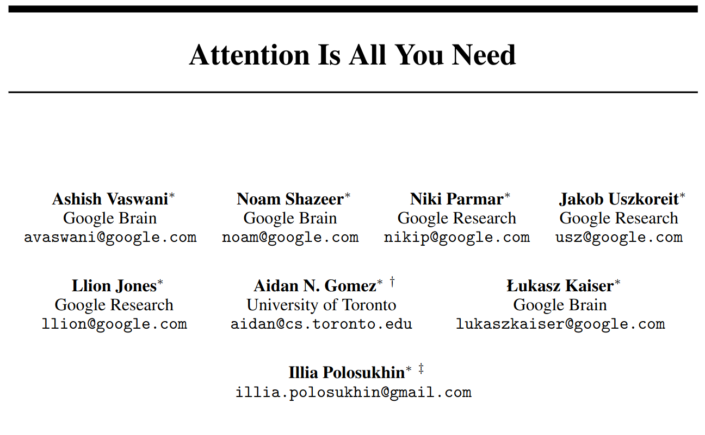
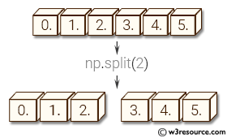
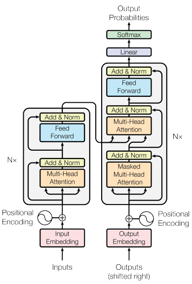
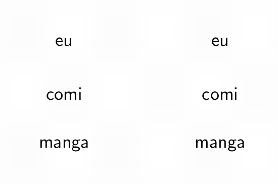
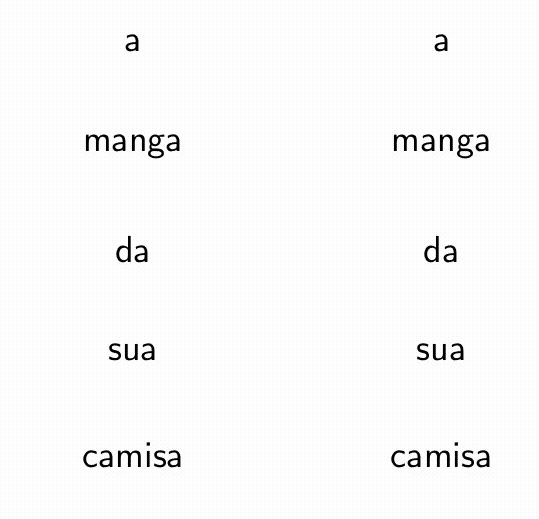
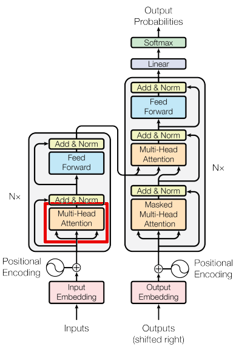
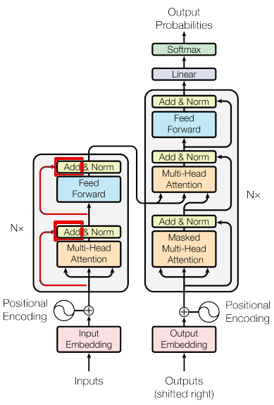
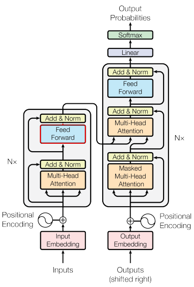
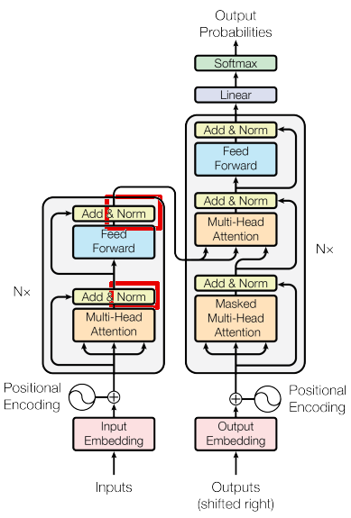
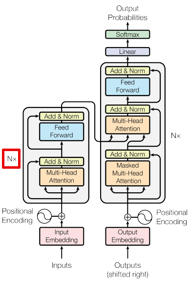

# LLMs-from-scratch-explained
This repository presents an GPT-Like implementation from scratch explaining not only the code, but also the intuition behind each transformer block part.

The transformers architecture was proposed in the paper:



# Why attention?

Can you find the man with red white striped shirt?


How about now?


And now?


You can see it is easier to find the man in the third one then in the first one.

But why?

Because there is a attention on it, ignoring or reducing all not useful information.


# Attention as soft dict

Selective attention mechanism can be seen as a soft-dict, but before, let's see how a Python dict works

## how python dict works? (also called hard dict)

```python
data = {'A': 1, 'C': 2}
query = 'C'

keys = list(data.keys())
values = list(data.values())

print('Query: ', query, '\nKeys:  ', keys, '\nValues:', values)
```

Output:

```shell
Query:  C
Keys:   ['A', 'C']
Values: [1, 2]
```

```python
data[query]
```

Output:

```shell
2
```

The result of the query 'C' in a dict with keys ['A', 'C'] is just the value of the key 'C'.

But what if I try to query 'B'?

```python
query = 'B'
data[query]
```

Output:

```shell
Traceback (most recent call last):
  File "<stdin>", line 1, in <module>
KeyError: 'B'
```

The hard dict does not allow queries that are not explicitly presented as keys.

**How could we reformulate a dictionary that allows queries that are not in the keys?**

```python
query = 'B'
data[query]
```
**posible answer**:

Use a similarity notion between the query and keys and return the weighted average between its values

For instance,
```python
Query:  'B'
Keys:   ['A', 'C']
Values: [1, 2]
```
'B' is exactly between 'A' and 'C', so one can say:

'B' is 0.5 of 'A' and 0.5 of 'C'
and return the weighted average:
```python
data['B'] = 0.5 * data['A'] + 0.5 * data['C']
```
i.e.
```python
data['B'] = 0.5 * 1 + 0.5 * 3
data['B'] = 1.5
```

## Implementing attention as a soft dict

Assuming query, keys and values as vectors,
one can implement:

```python
def attention_as_soft_dict(query, keys, values):
    weights = query @ keys.T  # kinda similarity between query and keys
    weights = F.softmax(weights, dim=-1)  # normalize weights to sum 1
    return weights @ values  # values weighted average
```

```python
keys = torch.tensor([[1.,0],[0, 1.]])
values = torch.tensor([[1., 0], [0, 1.]])
query = torch.tensor([[1., 0.]])

attention_as_soft_dict(query, keys, values)
```
Output:
```shell
tensor([[0.7311, 0.2689]])
```


## Scaled dot product attention
### Why do I need to scale?
Let's try to multiply two tensors with mean ~ 0 and variance ~ 1.:

```python
def tabulate_multiplication_mean_and_var(*tensors):
    multiplication = tensors[0] @ tensors[1]
    scaled_multiplication = multiplication / math.sqrt(tensors[0].shape[-1])
    tensors = [*tensors, multiplication, scaled_multiplication]
    return pd.DataFrame(data=[[tensor.mean().item(), tensor.var().item()]
                              for tensor in tensors],
                        columns=['mean', 'variance'],
                        index=['a', 'b', 'a @ b', 'a @ b / sqrt(d)'])


a = torch.randn(size=(10, 10))
b = torch.randn(size=(10, 10))

tabulate_multiplication_mean_and_var(a, b)
```

Output:

<table border="1" class="dataframe">
  <thead>
    <tr style="text-align: right;">
      <th></th>
      <th>mean</th>
      <th>variance</th>
    </tr>
  </thead>
  <tbody>
    <tr>
      <th>a</th>
      <td>0.183934</td>
      <td>0.567983</td>
    </tr>
    <tr>
      <th>b</th>
      <td>0.085248</td>
      <td>1.328079</td>
    </tr>
    <tr>
      <th>a @ b</th>
      <td>0.188607</td>
      <td>9.407702</td>
    </tr>
    <tr>
      <th>a @ b / sqrt(d)</th>
      <td>0.059643</td>
      <td>0.940770</td>
    </tr>
  </tbody>
</table>

It is possible to see that the variance of multiplication grows but it is not the same for its scaled version.

But What is its high variance impact in the softmax function?


```python
a = torch.tensor([0.1, 0.2, 0.7])
b = 100 * a

print('Softmax a:', F.softmax(a, dim=-1), '\nSoftmax b:',F.softmax(b, dim=-1))
```

Output:
```shell
Softmax a: tensor([0.2546, 0.2814, 0.4640])
Softmax b: tensor([8.7565e-27, 1.9287e-22, 1.0000e+00]
```

For greater values, the function tends to 1, so all other values, even if proportionally equal are reduced to zero.

### scaled dot product attention implementation
```python
def attention_as_scaled_soft_dict(query, keys, values):
    length, head_dim = query.shape
    weights = query @ keys.transpose(-2, -1)  # kinda similarity between query and keys
    weights = F.softmax(weights / math.sqrt(head_dim), dim=-1)  # normalize weights to sum 1
    return weights @ values  # values weighted average


attention_as_scaled_soft_dict(query, keys, values)
```
```shell
tensor([[0.6698, 0.3302]])
```

# Self-attention
What if I do not know what I want to query?

Or worst, If I do not know which are the keys and values stored?

**Quick answer**:

I can learn it from the input?

- What am I looking for? Query
- What is stored? Keys
- What are the values of stored keys? Values

```python
query  = Linear(inputs)
keys   = Linear(inputs)
values = Linear(inputs)
```
As the query, keys and values are extracted from the same source (inputs), its called self-attention

## Implementation of self-attention

```python
class SelfAttention(nn.Module):
    def __init__(self, embed_dim, head_dim):
        super().__init__()
        self.query = nn.Linear(embed_dim, head_dim, bias=False)
        self.key = nn.Linear(embed_dim, head_dim, bias=False)
        self.value = nn.Linear(embed_dim, head_dim, bias=False)

    def forward(self, embeddings):
        return attention_as_scaled_soft_dict(
            query=self.query(embeddings),
            keys=self.key(embeddings),
            values=self.value(embeddings)
        )
```


## Why do i need multi-head?

have you ever you are in a big supermarket wanting to buy some product but you don't know where is it stored?


In this case, you usually ask for help. what is the usual answer to the question:

"Do you know where is the frozen chicken?"

probably is "have you seen in the frozen section? It is in the upper left corner"


Probably, you will easily find what you need.

Then you now want a bread and ask again for help. the new answer could be:
"It is in the bakery section. It is in the upper part"


After see the section-wise market organization, you will start to look for sections instead of products. Then you can find easily what you want.

The same applies to our attention as soft dict. If you store information as section, it will be ease to find some key you are looking for. How to implement it?



## Implementing multi-head self-attention

```python
class MultiHeadSelfAttention(nn.Module):
    def __init__(self, embedding_dim, n_heads):
        super().__init__()

        self.heads = nn.ModuleList([
            SelfAttention(embedding_dim, head_dim = embedding_dim // n_heads)
            for _ in range(n_heads)
        ])

        assert embedding_dim % n_heads == 0, \
            "embedding dim should be divisible by n heads"

    def forward(self, embeddings):
        return torch.cat([head(embeddings) for head in self.heads], dim=-1)
```

and adding a projections:

```python
class MultiHeadSelfAttention(nn.Module):
    def __init__(self, embedding_dim, n_heads):
        super().__init__()

        self.heads = nn.ModuleList([
            SelfAttention(embedding_dim, head_dim = embedding_dim // n_heads)
            for _ in range(n_heads)
        ])

        self.proj = nn.Linear(embedding_dim, embedding_dim)
        self.dropout = nn.Dropout(DROPOUT)

        assert embedding_dim % n_heads == 0, \
            "embedding dim should be divisible by n heads"

    def forward(self, embeddings):
        x = torch.cat([head(embeddings) for head in self.heads], dim=-1)
        x = self.proj(x)
        x = self.dropout(x)
        return x
```

Remember this point, we will increment the implementation later

# transformers



## intuition

Updating the meaning of words based on the relations of words



A second example of "manga"



We can repeat it, updating the meaning of tokens based on the updated meaning

## how do they learn?

There is main two semi-supervised training methods:
 - Masked Language modeling
 - Causal language modeling


### Masked language modeling

 - Eu gosto de <font color='red'>\<mask\></font> mas não de cachorro

 - Eu gosto de <font color='red'>\<mask\></font> mas não de <font color='red'>cachorro</font>

 - Eu gosto de <font color='red'>gato</font> mas não de <font color='red'>cachorro</font>


```python
{
"gato": 0.87
"animais": 0.10
"rato": 0.01
}
```

It's similar when you don't get some word but you can infer it as you understand the rest of sentence


### Causal language modeling (predict next token)

- Eu amo ...

Have you ever completed someone else speech?

- Eu
- Eu amo
- Eu amo a
- Eu amo a Un


### Implementation of Masked self-attention

We will focus on causal language modeling used in generative models like GPT

What if you want to block certain keys in some query?

For instance, one wants to predict the next word in a sentence, so only previous words are allowed to be used as input:

```
I love <mask>
```
So we can modify the function `attention_as_scaled_soft_dict` to support an optional mask

this could emulate a causal mask, if we consider is each token and  each column is which tokens it has access

```python
torch.ones((10,10)).tril() # triangular lower
```
Output:
```shell
tensor([[1., 0., 0., 0., 0., 0., 0., 0., 0., 0.],
        [1., 1., 0., 0., 0., 0., 0., 0., 0., 0.],
        [1., 1., 1., 0., 0., 0., 0., 0., 0., 0.],
        [1., 1., 1., 1., 0., 0., 0., 0., 0., 0.],
        [1., 1., 1., 1., 1., 0., 0., 0., 0., 0.],
        [1., 1., 1., 1., 1., 1., 0., 0., 0., 0.],
        [1., 1., 1., 1., 1., 1., 1., 0., 0., 0.],
        [1., 1., 1., 1., 1., 1., 1., 1., 0., 0.],
        [1., 1., 1., 1., 1., 1., 1., 1., 1., 0.],
        [1., 1., 1., 1., 1., 1., 1., 1., 1., 1.]])

```

# inverting the logic (1 is where it should not have access)

```python
torch.ones((10,10)).triu(diagonal=1) # triangular upper
```
Output:
```shell
tensor([[0., 1., 1., 1., 1., 1., 1., 1., 1., 1.],
        [0., 0., 1., 1., 1., 1., 1., 1., 1., 1.],
        [0., 0., 0., 1., 1., 1., 1., 1., 1., 1.],
        [0., 0., 0., 0., 1., 1., 1., 1., 1., 1.],
        [0., 0., 0., 0., 0., 1., 1., 1., 1., 1.],
        [0., 0., 0., 0., 0., 0., 1., 1., 1., 1.],
        [0., 0., 0., 0., 0., 0., 0., 1., 1., 1.],
        [0., 0., 0., 0., 0., 0., 0., 0., 1., 1.],
        [0., 0., 0., 0., 0., 0., 0., 0., 0., 1.],
        [0., 0., 0., 0., 0., 0., 0., 0., 0., 0.]])
```


```python
def masked_attention_as_scaled_soft_dict(query, keys, values, mask=None):
    _, n_queries, head_dim = query.shape
    n_keys = keys.size(-2)

    weights = query @ keys.transpose(-2, -1)  # kinda similarity between query and keys
    weights = weights / math.sqrt(head_dim)
    if mask is None:  # adds causal mask
        mask = torch.ones(n_queries, n_keys, dtype=torch.bool, device=device).triu(diagonal=1)

    # mitigate some relations
    weights.masked_fill_(mask, float("-inf"))
    weights = F.softmax(weights, dim=-1)  # normalize weights to sum 1
    return weights @ values  # values weighted average
```

```python
keys = torch.tensor([[[1.,0],[0, 1.]]], device=device)  # batch, length, head_dim
values = torch.tensor([[[1., 0], [0, 1.]]], device=device)
query = torch.tensor([[[1., 0.]]], device=device)

masked_attention_as_scaled_soft_dict(query, keys, values)
```
Output:
```shell
tensor([[[1., 0.]]], device='cuda:0')
```

### Implementing a transformer block

Redefining SelfAttention to use masked_attention_as_scaled_soft_dict

```python
class SelfAttention(nn.Module):
    def __init__(self, embed_dim, head_dim):
        super().__init__()
        self.query = nn.Linear(embed_dim, head_dim, bias=False)
        self.key = nn.Linear(embed_dim, head_dim, bias=False)
        self.value = nn.Linear(embed_dim, head_dim, bias=False)

        self.dropout = nn.Dropout(DROPOUT)

    def forward(self, embeddings):
        return self.masked_attention_as_scaled_soft_dict(
            query=self.query(embeddings),
            keys=self.key(embeddings),
            values=self.value(embeddings)
        )

    def masked_attention_as_scaled_soft_dict(self, query, keys, values, mask=None):
        _, n_queries, head_dim = query.shape
        n_keys = keys.size(-2)

        weights = query @ keys.transpose(-2, -1)  # kinda similarity between query and keys
        weights = weights / math.sqrt(head_dim)
        if mask is None:  # adds causal mask
            mask = torch.ones(n_queries, n_keys, dtype=torch.bool, device=device).triu(diagonal=1)

        # mitigate some relations
        weights.masked_fill_(mask, float("-inf"))
        weights = F.softmax(weights, dim=-1)  # normalize weights to sum 1
        weights = self.dropout(weights)
        return weights @ values  # values weighted average
```

Updating relations between tokens



```python
class TransformerBlock(nn.Module):
    def __init__(self, embedding_dim, n_heads=8):
        super().__init__()

        self.attention = MultiHeadSelfAttention(embedding_dim, n_heads)

    def forward(self, embeddings):
        return self.attention(embeddings)
```

Residual connection -> The relation between tokens just says the change in the meaning



```python
class TransformerBlock(nn.Module):
    def __init__(self, embedding_dim, n_heads=8):
        super().__init__()

        self.attention = MultiHeadSelfAttention(embedding_dim, n_heads)

    def forward(self, embeddings):
        return embeddings + self.attention(embeddings)
```

Look the local information (what happened to each token)




```python
class TransformerBlock(nn.Module):
    def __init__(self, embedding_dim, n_heads=8, hidden_dim=1024):
        super().__init__()

        self.attention = MultiHeadSelfAttention(embedding_dim, n_heads)
        self.feed_forward = nn.Sequential(
            nn.Linear(embedding_dim, hidden_dim),
            nn.ReLU(),
            nn.Linear(hidden_dim, embedding_dim),
            nn.Dropout(DROPOUT),
        )

    def forward(self, embeddings):
        x = embeddings + self.attention(embeddings)
        return x + self.feed_forward(x)
```

Adding some normalizations




```python
class TransformerBlock(nn.Module):
    def __init__(self, embedding_dim, n_heads=8, hidden_dim=1024):
        super().__init__()

        self.attention = MultiHeadSelfAttention(embedding_dim, n_heads)
        self.feed_forward = nn.Sequential(
            nn.Linear(embedding_dim, hidden_dim),
            nn.ReLU(),
            nn.Linear(hidden_dim, embedding_dim),
            nn.Dropout(DROPOUT),
        )
        self.norm1 = nn.LayerNorm(embedding_dim)
        self.norm2 = nn.LayerNorm(embedding_dim)


    def forward(self, embeddings):
        x = self.norm1(embeddings + self.attention(embeddings))
        return self.norm1(x + self.feed_forward(x))
```

repeat it n times (update the meaning of words based on updated meanings)




```python
class GPTLike(nn.Module):
    def __init__(self, n_layers, vocab_size, CONTEXT_LENGTH, embedding_dim,
                 n_heads=8, hidden_dim=1024):
        super().__init__()

        self.tokens_embeddings = nn.Embedding(vocab_size, embedding_dim)
        self.position_embeddings = nn.Embedding(CONTEXT_LENGTH, embedding_dim)

        self.transformer = nn.Sequential(*[
            TransformerBlock(embedding_dim, n_heads, hidden_dim)
            for _ in range(n_layers)
        ])

        self.lm_head = nn.Linear(embedding_dim, vocab_size)


    def forward(self, input_ids):
        tokens_embeddings = self.tokens_embeddings(input_ids)
        positional_embeddings = self.position_embeddings(
            torch.arange(input_ids.size(-1), device=device)
        )
        embeddings = tokens_embeddings + positional_embeddings
        x = self.transformer(embeddings)
        logits = self.lm_head(x)
```

Adding training and generation support

```python
class GPTLike(nn.Module):
    def __init__(self, n_layers, vocab_size, CONTEXT_LENGTH, embedding_dim,
                 n_heads=8, hidden_dim=1024):

        super().__init__()
        self.tokens_embeddings = nn.Embedding(vocab_size, embedding_dim)
        self.position_embeddings = nn.Embedding(CONTEXT_LENGTH, embedding_dim)

        self.transformer = nn.Sequential(*[
            TransformerBlock(embedding_dim, n_heads, hidden_dim)
            for _ in range(n_layers)
        ])

        self.lm_head = nn.Linear(embedding_dim, vocab_size, bias=False)
        # self.lm_head.weight.data = self.tokens_embeddings.weight.data


    def forward(self, input_ids, targets=None):
        tokens_embeddings = self.tokens_embeddings(input_ids)
        positional_embeddings = self.position_embeddings(
            torch.arange(input_ids.size(-1), device=device)
        )
        embeddings = tokens_embeddings + positional_embeddings
        x = self.transformer(embeddings)
        logits = self.lm_head(x)

        if targets is None:
            loss = None

        else:
            B, T, C = logits.shape
            logits = logits.view(B*T, C)
            targets = targets.view(B*T)

            loss = F.cross_entropy(logits, targets)

        return logits, loss

    @torch.no_grad
    def generate(self, ids, max_new_tokens):
        self.eval()

        for _ in range(max_new_tokens):
            ids = ids[:, -CONTEXT_LENGTH:]
            logits, loss = model(ids)
            logits = logits[:,-1,:] # get last token prediction
            probs = F.softmax(logits, dim=-1)
            # get most probable token
            next_ids = torch.argmax(probs, dim=-1, keepdims=True)
            # next_ids = torch.multinomial(probs, num_samples=1)
            ids = torch.cat((ids, next_ids), dim=1)

        return ids
```

